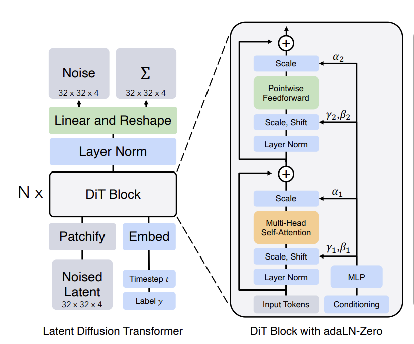

# **模型迁移教程：从PyTorch迁移到MindSpore**

通过本教程，您将学习如何将PyTorch模型的推理和训练代码迁移到MindSpore框架，确保迁移后精度一致并发挥MindSpore在NPU上的性能优势。

## 迁移目标和步骤

本教程以DiT（Diffusion Transformer）模型为例，详细介绍如何将PyTorch代码迁移到MindSpore框架。迁移具体步骤如下：

1. **迁移准备工作**：配置环境、准备数据集并分析PyTorch代码。
2. **模型前向对齐**：转换模型代码和权重，验证组网正确性。
3. **数据处理对齐**：调整数据集读取和加载代码，适配MindSpore的数据加载方式。
4. **模型训练对齐**：对齐损失函数、超参和学习率。

## 迁移准备工作

### 安装MindSpore和PyTorch

- MindSpore安装

    请参考[MindSpore官网安装指南](https://www.mindspore.cn/install)。本教程中使用：
    - MindSpore版本: 2.5.0
    - CANN 版本: 8.0.0.beta1

    安装完成后，验证安装：

    ```bash
    python -c "import mindspore as ms; ms.run_check()"
    ```

    预期输出：
    ```bash
    MindSpore version: 2.5.0
    The result of multiplication caclulation is correct, MindSpore has been installed on platform [Ascend] successfully!
    ```

- PyTorch安装

    请参考[PyTorch官网安装指南](https://pytorch.org/get-started/locally/)，本教程使用PyTorch2.5.1
    安装完成后，验证安装：

    ```bash
    python -c "import torch; print(torch.__version__); print(torch.cuda.is_available()); print(torch.Tensor([0.0]).cuda())"
    ```

### 安装MindONE

请通过以下的方式来下载并安装MindONE:
```
git clone https://github.com/mindspore-lab/mindone.git
cd mindone
pip install -e .
```

安装完成后，验证安装：
```bash
python -c "import mindone; print(mindone.__version__)"  
```

如果安装成功，则输出版本号。

请继续安装如下的依赖：
```bash
pip install imageio==2.31.2 gdown einops omegaconf safetensors albumentations
```
或者参考[requirements.txt](https://github.com/mindspore-lab/mindone/blob/master/examples/dit/requirements.txt) 并使用`pip install -r requirements.txt` 安装依赖。


### 准备数据集


DiT是一个用于类别生成图像任务的模型，为便于精度对齐，我们构建了一个小型的图像二分类数据集[CatDogTiny](https://huggingface.co/datasets/jasonhuang23/cat_dog_tiny)，包含400张图片，分为两类：{"0": "cat", "1": "dog"}。

下载该数据集到`./datasets`:

```bash
pip install -U "huggingface_hub[cli]"
mkdir -p dit/datasets
huggingface-cli download jasonhuang23/cat_dog_tiny --repo-type dataset --local-dir dit/datasets/
```

### 下载权重

- DiT权重

参考[DiT的官方仓库](https://github.com/facebookresearch/DiT)提供的权重链接，下载`DiT-XL-2-256x256`和`DiT-XL-2-512x512`预训练权重，并保存到`dit/models`:

```shell
mkdir -p dit/models

# 下载256x256图像生成模型权重
wget -c https://dl.fbaipublicfiles.com/DiT/models/DiT-XL-2-256x256.pt -P dit/models

# 下载512x512图像生成模型权重（可选）
wget -c https://dl.fbaipublicfiles.com/DiT/models/DiT-XL-2-512x512.pt -P dit/models
```

- VAE权重

从[huggingface/stabilityai.co](https://huggingface.co/stabilityai/sd-vae-ft-mse/tree/main)下载VAE权重文件:

```shell
huggingface-cli download  stabilityai/sd-vae-ft-mse --local-dir dit/models --include diffusion_pytorch_model.bin
```


### 下载并分析PyTorch代码

我们需要在CPU/GPU/NPU上，跑通PyTorch参考代码的推理和训练过程，以对比和验证迁移结果的正确性。

下载[PyTorch DiT](https://github.com/facebookresearch/DiT)代码:
```
git clone https://github.com/facebookresearch/DiT.git
cd DiT
```

其主要的目录结构如下：

```
DiT/
├── diffusion
│   ├── __init__.py
│   ├── diffusion_utils.py
│   ├── gaussian_diffusion.py
│   ├── respace.py
│   └── timestep_sampler.py
├── models.py
├── sample.py
└── train.py 
```

核心模型训练脚本位于`DiT/train.py`，分析其逻辑：

```python
    # Create model:
    assert args.image_size % 8 == 0, "Image size must be divisible by 8 (for the VAE encoder)."
    latent_size = args.image_size // 8
    model = DiT_models[args.model](
        input_size=latent_size,
        num_classes=args.num_classes
    )
    # Note that parameter initialization is done within the DiT constructor
    ema = deepcopy(model).to(device)  # Create an EMA of the model for use after training
    requires_grad(ema, False)
    model = DDP(model.to(device), device_ids=[rank])
    diffusion = create_diffusion(timestep_respacing="")  # default: 1000 steps, linear noise schedule
    vae = AutoencoderKL.from_pretrained(f"stabilityai/sd-vae-ft-{args.vae}").to(device)
    logger.info(f"DiT Parameters: {sum(p.numel() for p in model.parameters()):,}")

    opt = torch.optim.AdamW(model.parameters(), lr=1e-4, weight_decay=0)
```

这段代码涉及训练初始化阶段，主要包括创建DiT模型、初始化EMA权重、创建VAE模型（变分自编码器，用于对图像进行编码和解码）、创建diffusion scheduler以及优化器。

```python
    for epoch in range(args.epochs):
        sampler.set_epoch(epoch)
        logger.info(f"Beginning epoch {epoch}...")
        for x, y in loader:
            x = x.to(device)
            y = y.to(device)
            with torch.no_grad():
                # Map input images to latent space + normalize latents:
                x = vae.encode(x).latent_dist.sample().mul_(0.18215)
            t = torch.randint(0, diffusion.num_timesteps, (x.shape[0],), device=device)
            model_kwargs = dict(y=y)
            loss_dict = diffusion.training_losses(model, x, t, model_kwargs)
            loss = loss_dict["loss"].mean()
            opt.zero_grad()
            loss.backward()
            opt.step()
            update_ema(ema, model.module)
```

这段代码实现了训练的迭代过程，主要包括训练批数据加载、VAE和DiT的前向计算、损失函数计算、以及模型参数和EMA的更新。


## 模型结构分析及代码迁移

DiT是基于Transformer架构的扩散生成模型，相比Stable Diffusion这类使用U-Net骨干网络的生成模型，DiT的可扩展性更好，是当前图像视频生成式SoTA的主流架构。其网络结构如下：

<p align="center">
  
</p>
<p align="center">
  <em> DiT网络结构及DiT block </em>
</p>


### 网络结构代码转换

DiT网络结构的PyTorch实现：[DiT/models.py](https://github.com/facebookresearch/DiT/blob/main/models.py)

我们参考[PyTorch与MindSpore API映射表](https://www.mindspore.cn/docs/zh-CN/master/note/api_mapping/pytorch_api_mapping.html)，按照以下的步骤进行转换：
1. 将`nn.Module`替换为`nn.Cell`, 同时将`def forward`替换成`def construct`。
2. 对于单层Layer，在[PyTorch与MindSpore API映射表](https://www.mindspore.cn/docs/zh-CN/master/note/api_mapping/pytorch_api_mapping.html)中找到对应的MindSpore API， 替换成对应的代码。 例如`nn.Linear`, `nn.Linear`替换成`mint.nn.Linear`。
3. 对于不能直接进行API替换的Layer, 例如PyTorch代码中调用的`from timm.models.vision_transformer import PatchEmbed, Attention, Mlp`，都需要找到对应的PyTorch源码，重复步骤2，进行代码转换。经过转换后的MindSpore： [PatchEmbed](https://github.com/mindspore-lab/mindone/blob/master/mindone/models/dit.py#L41), [Attention](https://github.com/mindspore-lab/mindone/blob/master/mindone/models/dit.py#L158), [Mlp](https://github.com/mindspore-lab/mindone/blob/master/mindone/models/dit.py#L132)。
4. MindSpore 的权重初始化方式和PyTorch的权重初始化方式有细微不同。PyTorch的初始化常常调用`torch.nn.init`的相关接口, 并使用`Tensor.copy_`来进行赋值。MindSpore初始化常常调用`mindspore.common.initializer`的相关接口，并且使用`Parameter.set_data`来进行权重赋值。下面展示PyTorch和MindSpore初始化权重的代码。


经过转换后，MindSpore DiT模型代码：[mindone/models/dit.py](https://github.com/mindspore-lab/mindone/blob/master/mindone/models/dit.py)。


我们截取DiT主要的模块`DiTBlock`的PyTorch和MindSpore代码进行对比，来展示模型代码转换的主要过程。

<table>
<tr>
<th> Torch </th>
<th> MindSpore </th>
</tr>
<tr>
<td>

```python
class DiTBlock(nn.Module):
    """
    A DiT block with adaptive layer norm zero (adaLN-Zero) conditioning.
    """
    def __init__(self, hidden_size, num_heads, mlp_ratio=4.0, **block_kwargs):
        super().__init__()
        self.norm1 = nn.LayerNorm(hidden_size, elementwise_affine=False, eps=1e-6)
        self.attn = Attention(hidden_size, num_heads=num_heads, qkv_bias=True, **block_kwargs)
        self.norm2 = nn.LayerNorm(hidden_size, elementwise_affine=False, eps=1e-6)
        mlp_hidden_dim = int(hidden_size * mlp_ratio)
        approx_gelu = lambda: nn.GELU(approximate="tanh")
        self.mlp = Mlp(in_features=hidden_size, hidden_features=mlp_hidden_dim, act_layer=approx_gelu, drop=0)
        self.adaLN_modulation = nn.Sequential(
            nn.SiLU(),
            nn.Linear(hidden_size, 6 * hidden_size, bias=True)
        )

    def forward(self, x, c):
        shift_msa, scale_msa, gate_msa, shift_mlp, scale_mlp, gate_mlp = self.adaLN_modulation(c).chunk(6, dim=1)
        x = x + gate_msa.unsqueeze(1) * self.attn(modulate(self.norm1(x), shift_msa, scale_msa))
        x = x + gate_mlp.unsqueeze(1) * self.mlp(modulate(self.norm2(x), shift_mlp, scale_mlp))
        return x
```

</td>
<td>

```python
class DiTBlock(nn.Cell):
    """
    A DiT block with adaptive layer norm zero (adaLN-Zero) conditioning.
    """

    def __init__(self, hidden_size, num_heads, mlp_ratio=4.0, **block_kwargs):
        super().__init__()
        self.norm1 = mint.nn.LayerNorm(hidden_size, elementwise_affine=False, eps=1e-6)
        self.attn = SelfAttention(hidden_size, num_heads=num_heads, qkv_bias=True, **block_kwargs)
        self.norm2 = mint.nn.LayerNorm(hidden_size, elementwise_affine=False, eps=1e-6)
        mlp_hidden_dim = int(hidden_size * mlp_ratio)
        approx_gelu = lambda: GELU(approximate="tanh")
        self.mlp = Mlp(in_features=hidden_size, hidden_features=mlp_hidden_dim, act_layer=approx_gelu, drop=0)
        self.adaLN_modulation = nn.SequentialCell(
            mint.nn.SiLU(), mint.nn.Linear(hidden_size, 6 * hidden_size, bias=True)
        )

    def construct(self, x, c):
        shift_msa, scale_msa, gate_msa, shift_mlp, scale_mlp, gate_mlp = mint.chunk(self.adaLN_modulation(c), 6, dim=1)
        x = x + gate_msa.unsqueeze(1) * self.attn(modulate(self.norm1(x), shift_msa, scale_msa))
        x = x + gate_mlp.unsqueeze(1) * self.mlp(modulate(self.norm2(x), shift_mlp, scale_mlp))
        return x
```

</td>
</tr>
</table>


<table>
<tr>
<th> Torch </th>
<th> MindSpore </th>
</tr>
<tr>
<td>

```python
    def initialize_weights(self):
        # Initialize transformer layers:
        def _basic_init(module):
            if isinstance(module, nn.Linear):
                torch.nn.init.xavier_uniform_(module.weight)
                if module.bias is not None:
                    nn.init.constant_(module.bias, 0)
        self.apply(_basic_init)

        # Initialize (and freeze) pos_embed by sin-cos embedding:
        pos_embed = get_2d_sincos_pos_embed(self.pos_embed.shape[-1], int(self.x_embedder.num_patches ** 0.5))
        self.pos_embed.data.copy_(torch.from_numpy(pos_embed).float().unsqueeze(0))

        # Initialize patch_embed like nn.Linear (instead of nn.Conv2d):
        w = self.x_embedder.proj.weight.data
        nn.init.xavier_uniform_(w.view([w.shape[0], -1]))
        nn.init.constant_(self.x_embedder.proj.bias, 0)

        # Initialize label embedding table:
        nn.init.normal_(self.y_embedder.embedding_table.weight, std=0.02)

        # Initialize timestep embedding MLP:
        nn.init.normal_(self.t_embedder.mlp[0].weight, std=0.02)
        nn.init.normal_(self.t_embedder.mlp[2].weight, std=0.02)

        # Zero-out adaLN modulation layers in DiT blocks:
        for block in self.blocks:
            nn.init.constant_(block.adaLN_modulation[-1].weight, 0)
            nn.init.constant_(block.adaLN_modulation[-1].bias, 0)

        # Zero-out output layers:
        nn.init.constant_(self.final_layer.adaLN_modulation[-1].weight, 0)
        nn.init.constant_(self.final_layer.adaLN_modulation[-1].bias, 0)
        nn.init.constant_(self.final_layer.linear.weight, 0)
        nn.init.constant_(self.final_layer.linear.bias, 0)
```

</td>
<td>

```python
    from .utils import xavier_uniform_, constant_, normal_
    def initialize_weights(self):
        # Initialize transformer layers:
        def _basic_init(module):
            if isinstance(module, mint.nn.Linear):
                xavier_uniform_(module.weight)
                if module.bias is not None:
                    constant_(module.bias, 0)

        self.apply(_basic_init)

        # Initialize (and freeze) pos_embed by sin-cos embedding:
        pos_embed = get_2d_sincos_pos_embed(self.pos_embed.shape[-1], int(self.x_embedder.num_patches**0.5))
        self.pos_embed.set_data(Tensor(pos_embed).float().unsqueeze(0))

        # Initialize patch_embed like nn.Linear (instead of nn.Conv2d):
        w = self.x_embedder.proj.weight
        # xavier_uniform_(w.view(w.shape[0], -1))
        w_flatted = w.view(w.shape[0], -1)
        w.set_data(initializer(XavierUniform(), w_flatted.shape, w_flatted.dtype).reshape(w.shape))
        constant_(self.x_embedder.proj.bias, 0)

        # Initialize label embedding table:
        normal_(self.y_embedder.embedding_table.weight, std=0.02)

        # Initialize timestep embedding MLP:
        normal_(self.t_embedder.mlp[0].weight, std=0.02)
        normal_(self.t_embedder.mlp[2].weight, std=0.02)

        # Zero-out adaLN modulation layers in DiT blocks:
        for block in self.blocks:
            constant_(block.adaLN_modulation[-1].weight, 0)
            constant_(block.adaLN_modulation[-1].bias, 0)

        # Zero-out output layers:
        constant_(self.final_layer.adaLN_modulation[-1].weight, 0)
        constant_(self.final_layer.adaLN_modulation[-1].bias, 0)
        constant_(self.final_layer.linear.weight, 0)
        constant_(self.final_layer.linear.bias, 0)
```

</td>
</tr>
</table>

其中MindSpore调用的初始化函数`xavier_uniform_`, `constant_`, `normal_`，参考[utils.py](https://github.com/mindspore-lab/mindone/blob/master/mindone/models/utils.py)。

### 权重转换

由于预训练模型权重格式为`.pt`，我们需要先将PyTorch权重转换成MindSpore权重，主要逻辑是读取PyTorch权重的各个参数，转换成MindSpore的参数(`Parmeter`)，并且保存为`.ckpt`文件。

我们使用[dit/tools/dit_converter.py](https://github.com/mindspore-lab/mindone/blob/master/examples/dit/tools/dit_converter.py)脚本对DiT权重进行转换：

```bash
python dit_converter.py --source models/DiT-XL-2-256x256.pt --target models/DiT-XL-2-256x256.ckpt
```

类似地，我们使用[dit/tools/vae_converter.py](https://github.com/mindspore-lab/mindone/blob/master/examples/dit/tools/vae_converter.py)对VAE权重进行转换：
```bash
python vae_converter.py --source models/diffusion_pytorch_model.bin --target models/sd-vae-ft-mse.ckpt
```

转换后，在`models/`下的ckpt应如下所示：
```bash
models/
├── DiT-XL-2-256x256.ckpt
├── DiT-XL-2-256x256.pt
├── diffusion_pytorch_model.bin  # vae
└── sd-vae-ft-mse.ckpt
```

经过数据集准备和权重转换后，文件夹的结构应该如下所示：
```bash
dit/
├── models/
│   ├── DiT-XL-2-256x256.ckpt
│   ├── DiT-XL-2-256x256.pt
│   └── ...
├── datasets/
│   ├── cat/
│   ├── dog/
│   └── labels.csv
├── ...
├── DiT/  # torch参考实现
├── mindone/  # MindONE主仓
├── tools/
└── train_dit.py
```


## 数据处理对齐

在模型训练过程中，数据处理是相当重要的一个环节，相同的模型使用不同的数据增强方法，其训练结果往往也存在差异。

### 数据处理代码迁移

PyTorch进行数据读取和预处理的代码如下，其中预处理函数包括center_crop, RandomHorizontalFlip, ToTensor和Normalize。同时， DataLoader支持多卡数据并行。
```python
    from torchvision.datasets import ImageFolder
    from torchvision import transforms
    from torch.utils.data import DataLoader
    # Setup data:
    transform = transforms.Compose([
        transforms.Lambda(lambda pil_image: center_crop_arr(pil_image, args.image_size)),
        transforms.RandomHorizontalFlip(),
        transforms.ToTensor(),
        transforms.Normalize(mean=[0.5, 0.5, 0.5], std=[0.5, 0.5, 0.5], inplace=True)
    ])
    dataset = ImageFolder(args.data_path, transform=transform)
    sampler = DistributedSampler(
        dataset,
        num_replicas=dist.get_world_size(),
        rank=rank,
        shuffle=True,
        seed=args.global_seed
    )
    loader = DataLoader(
        dataset,
        batch_size=int(args.global_batch_size // dist.get_world_size()),
        shuffle=False,
        sampler=sampler,
        num_workers=args.num_workers,
        pin_memory=True,
        drop_last=True
    )
    logger.info(f"Dataset contains {len(dataset):,} images ({args.data_path})")
```

转换成MindSpore实现：
- 数据读取：使用`mindspore.datasets`模块中的图像数据集加载接口[ImageFolderDataset](https://www.mindspore.cn/docs/zh-CN/r2.5.0/api_python/dataset/mindspore.dataset.ImageFolderDataset.html)替换torchvision的`ImageFolder`
- 数据增强：使用mindspore高性能数据增强模块[mindspore.dataset.transforms](https://www.mindspore.cn/docs/zh-CN/r2.5.0/api_python/mindspore.dataset.transforms.html)等效代替torchvision的`transforms`模块。
- 数据采样：使用`mindspore.datasets`中的[Dataset.batch](https://www.mindspore.cn/docs/zh-CN/r2.5.0/api_python/dataset/dataset_method/batch/mindspore.dataset.Dataset.batch.html)接口代替torch的`DataLoader`接口进行data batch采样。

转换后的具体代码如下：

```python
# https://www.mindspore.cn/docs/zh-CN/r2.5.0/api_python/dataset/mindspore.dataset.ImageFolderDataset.html

import mindspore as ms
from mindspore.dataset.transforms import Compose, vision
def create_dataloader_imagenet(
    config,
    device_num: Optional[int] = None,
    rank_id: Optional[int] = None,
):
    dataset = ms.dataset.ImageFolderDataset(
        config["data_folder"],
        shuffle=config["shuffle"],
        num_shards=device_num,
        shard_id=rank_id,
        num_parallel_workers=config["num_parallel_workers"],
        decode=False,
    )
    sample_size = config.get("sample_size", 256)
    dataset = dataset.map(
        operations=Compose(
            [
                vision.Decode(to_pil=True),
                _CenterCrop(sample_size),
                vision.RandomHorizontalFlip(),
                vision.HWC2CHW(),
                vision.Normalize([127.5, 127.5, 127.5], [127.5, 127.5, 127.5], is_hwc=False),
            ]
        )
    )

    dl = dataset.batch(config["batch_size"], drop_remainder=True)
    return dl
```
需要注意的是， MindSpore新增了`vision.Decode`, 用于将图像解码为PIL数据类型， 也新增了`vision.HWC2CHW`, 用于将图像的HWC格式转换为CHW格式。同时，MindSpore代码使用`vision.Normalize([127.5, 127.5, 127.5], [127.5, 127.5, 127.5], is_hwc=False)`， 可以达到与PyTorch代码中`transforms.ToTensor()`和`transforms.Normalize(mean=[0.5, 0.5, 0.5], std=[0.5, 0.5, 0.5], inplace=True)`等价的效果。

除了预处理函数的区别以外，MindSpore的`mindspore.dataset.ImageFolderDataset`实际上支持多卡数据并行，其中PyTorch代码中的`dist.get_world_size()`等价于MindSpore中的`num_shards`或者`device_num`。PyTorch代码中的`rank`等价于MindSpore中的`shard_id`或者`rank_id`。


## 模型训练对齐

### 损失函数对齐

PyTorch的训练损失函数： [GaussianDiffusion.training_losses](https://github.com/facebookresearch/DiT/blob/main/diffusion/gaussian_diffusion.py#L715)

MindSpore的训练损失函数： [DiTWithLoss.training_losses](https://github.com/mindspore-lab/mindone/blob/master/examples/dit/pipelines/train_pipeline.py#L133)

<table>
<tr>
<th> Torch </th>
<th> MindSpore </th>
</tr>
<tr>
<td>

```python
    def training_losses(self, model, x_start, t, model_kwargs=None, noise=None):
        x_t = self.q_sample(x_start, t, noise=noise)
        terms = {}
        ...
            model_output = model(x_t, t, **model_kwargs)

            if self.model_var_type in [
                ModelVarType.LEARNED,
                ModelVarType.LEARNED_RANGE,
            ]:
                B, C = x_t.shape[:2]
                assert model_output.shape == (B, C * 2, *x_t.shape[2:])
                model_output, model_var_values = th.split(model_output, C, dim=1)
                # Learn the variance using the variational bound, but don't let
                # it affect our mean prediction.
                frozen_out = th.cat([model_output.detach(), model_var_values], dim=1)
                terms["vb"] = self._vb_terms_bpd(
                    model=lambda *args, r=frozen_out: r,
                    x_start=x_start,
                    x_t=x_t,
                    t=t,
                    clip_denoised=False,
                )["output"]
                if self.loss_type == LossType.RESCALED_MSE:
                    # Divide by 1000 for equivalence with initial implementation.
                    # Without a factor of 1/1000, the VB term hurts the MSE term.
                    terms["vb"] *= self.num_timesteps / 1000.0

            target = {
                ModelMeanType.PREVIOUS_X: self.q_posterior_mean_variance(
                    x_start=x_start, x_t=x_t, t=t
                )[0],
                ModelMeanType.START_X: x_start,
                ModelMeanType.EPSILON: noise,
            }[self.model_mean_type]
            assert model_output.shape == target.shape == x_start.shape
            terms["mse"] = mean_flat((target - model_output) ** 2)
            if "vb" in terms:
                terms["loss"] = terms["mse"] + terms["vb"]
            else:
                terms["loss"] = terms["mse"]
```
</td>
<td>

```python
    def training_losses(self, x, y, text_embed):
        ...
        x_t = self.diffusion.q_sample(x, t, noise=noise)  # 对应torch 代码中的self.q_sample
        model_output = self.apply_model(x_t, t, y=y, text_embed=text_embed)  # 得到DiT模型的输出

        B, C = x_t.shape[:2]
        assert model_output.shape == (B, C * 2) + x_t.shape[2:]
        model_output, model_var_values = mint.split(model_output, C, dim=1)

        # Learn the variance using the variational bound, but don't let it affect our mean prediction.
        vb = self._vb_terms_bpd(ops.stop_gradient(model_output), model_var_values, x, x_t, t)  # _cal_vb 对应torch代码中的 self._vb_terms_bpd

        loss = mean_flat((noise - model_output) ** 2) + vb
        loss = loss.mean()
        return loss
```
</td>
</tr>
</table>

可以看出， PyTorch的损失函数由两部分组成，第一部分是模型的输出和当前的`target`之间的均方误差，第二部分是`vb`（Variational Bound）损失。

为了转换成MindSpore实现，我们主要参考[PyTorch与MindSpore API映射表](https://www.mindspore.cn/docs/zh-CN/master/note/api_mapping/pytorch_api_mapping.html)将损失函数涉及的算子替换成MIndSpore对应的API，如`split`, `concat`等。经过转换，MindSpore 的损失函数同样由均方误差和Variational Bound组成，只是去除了一些冗余的判定条件。

`_vb_terms_bpd`函数的代码对比如下：
<table>
<tr>
<th> Torch </th>
<th> MindSpore </th>
</tr>
<tr>
<td>

```python
    def _vb_terms_bpd(
            self, model, x_start, x_t, t, clip_denoised=True, model_kwargs=None
    ):
        """
        Get a term for the variational lower-bound.
        The resulting units are bits (rather than nats, as one might expect).
        This allows for comparison to other papers.
        :return: a dict with the following keys:
                 - 'output': a shape [N] tensor of NLLs or KLs.
                 - 'pred_xstart': the x_0 predictions.
        """
        true_mean, _, true_log_variance_clipped = self.q_posterior_mean_variance(
            x_start=x_start, x_t=x_t, t=t
        )
        out = self.p_mean_variance(
            model, x_t, t, clip_denoised=clip_denoised, model_kwargs=model_kwargs
        )
        kl = normal_kl(
            true_mean, true_log_variance_clipped, out["mean"], out["log_variance"]
        )
        kl = mean_flat(kl) / np.log(2.0)

        decoder_nll = -discretized_gaussian_log_likelihood(
            x_start, means=out["mean"], log_scales=0.5 * out["log_variance"]
        )
        assert decoder_nll.shape == x_start.shape
        decoder_nll = mean_flat(decoder_nll) / np.log(2.0)

        # At the first timestep return the decoder NLL,
        # otherwise return KL(q(x_{t-1}|x_t,x_0) || p(x_{t-1}|x_t))
        output = th.where((t == 0), decoder_nll, kl)
        return {"output": output, "pred_xstart": out["pred_xstart"]}
```

</td>
<td>

```python
    def _vb_terms_bpd(self, model_output, model_var_values, x, x_t, t):
        true_mean, _, true_log_variance_clipped = self.diffusion.q_posterior_mean_variance(x_start=x, x_t=x_t, t=t)
        min_log = _extract_into_tensor(self.diffusion.posterior_log_variance_clipped, t, x_t.shape)
        max_log = _extract_into_tensor(mint.log(self.diffusion.betas), t, x_t.shape)
        # The model_var_values is [-1, 1] for [min_var, max_var].
        frac = (model_var_values + 1) / 2
        model_log_variance = frac * max_log + (1 - frac) * min_log
        pred_xstart = self.diffusion.predict_xstart_from_eps(x_t=x_t, t=t, eps=model_output)
        model_mean, _, _ = self.diffusion.q_posterior_mean_variance(x_start=pred_xstart, x_t=x_t, t=t)
        kl = normal_kl(true_mean, true_log_variance_clipped, model_mean, model_log_variance)
        kl = mean_flat(kl) / ms.numpy.log(2.0)
        decoder_nll = -discretized_gaussian_log_likelihood(x, means=model_mean, log_scales=0.5 * model_log_variance)
        decoder_nll = mean_flat(decoder_nll) / ms.numpy.log(2.0)
        # At the first timestep return the decoder NLL, otherwise return KL(q(x_{t-1}|x_t,x_0) || p(x_{t-1}|x_t))
        vb = mint.where((t == 0), decoder_nll, kl)
        return vb
```

</td>
</tr>
</table>


### 训练超参对齐

从`DiT/train.py`脚本中，可分析出PyTorch的训练超参如下：
```yaml
优化器：AdamW
learning rate：0.0001
weight decay: 0
EMA：ON
```

为保证Loss收敛一致，我们应采用相同的训练超参，完整的MindSpore训练流程实现详见[train_dit.py](./train_dit.py)，其中涉及训练超参的关键代码如下：

```python
    from mindspore.nn.optim import AdamWeightDecay
    from mindone.trainers.ema import EMA

    optimizer = AdamWeightDecay(
        latent_diffusion_with_loss.trainable_params(),
        learning_rate=1e-4,
        beta1=0.9,
        beta2=0.999,
        weight_decay=0.0
        )
    ema = EMA(
            latent_diffusion_with_loss.network,
            ema_decay=0.9999,
        )
```

### 训练精度验证

在相同的数据集(cat-dog 400 images)下，PyTorch和MindSpore都载入相同的初始权重, 在上述相同的超参下，PyTorch和MindSpore都采用双卡训练，local batch size 都等于64，统一训练500 epochs, 总共训练3000个steps。

首先，我们需要进行PyTorch的训练。在原本的`DiT/train.py`基础上，我们只需要做如下的修改，确保初始的权重可以保存为`init_checkpoint.pt`:

```diff
    model = DiT_models[args.model](
        input_size=latent_size,
        num_classes=args.num_classes
    )
+   init_checkpoint = "init_checkpoint.pt"
+   torch.save(model.state_dict(), init_checkpoint)
```

在PyTorch环境执行如下的训练脚本：
```bash
torchrun --nnodes=1 --nproc_per_node=2 \
  train.py \
  --model DiT-XL/2 \
  --data-path ../datasets/ \
  --epochs 500 \
  --global-batch-size 128 \
  --num-classes 2 \
  --log-every 1 \
  --ckpt-every 1000 \
  --vae mse
```
在上述的训练结束后，训练过程中的Loss会保存在`./results/000-DiT-XL-2/log.txt`中。

接下来，我们需要将保存下来的初始权值`init_checkpoint.pt`转换成MindSpore的权重格式，可以使用如下的命令：
```bash
python tools/dit_converter.py --source DiT/init_checkpoint.pt --target models/init_checkpoint.ckpt
```

启动MindSpore训练脚本，详细超参参考[configs/training/class_cond_train.yaml](https://github.com/mindspore-lab/mindone/blob/master/examples/dit/configs/training/class_cond_train.yaml), 

```bash
msrun --bind_core=True --worker_num=2 --local_worker_num=2 --master_port=9000 --log_dir=outputs/class_cond_train/parallel_logs \
  train_dit.py \
  --data_path datasets/ \
  --train_batch_size 64 \
  --epochs 500 \
  --dit_checkpoint models/init_checkpoint.ckpt \
  --num_classes 2 \
  --enable_flash_attention True \
  --dataset_sink_mode True \
  --ckpt_save_interval 400 \
```
训练过程中的log文件可以通过`tail -f outputs/class_cond_train/parallel_logs/worker_0.log`查看。在上述的训练结束后，训练过程中的Loss会保存在`outputs/class_cond_train/exp/result.log`中。


## **训练性能与总结**

### 训练性能对比

本教程中使用到的MindSpore版本为2.5.0, CANN 版本为CANN 8.0.RC3。使用到的PyTorch版本为2.5.1，CUDA 版本为12.8。在上述的实验中，MindSpore和PyTorch的训练性能数据如下：

| 框架名称 | 模型名称 | 卡数 | 图片大小（HxW） | 单卡batch size | 训练速度（s/batch） | 吞吐量（imgs/s） |
| ------ | ------ | -- | ------------- | ----------- | ---------------- | -------------- |
| MindSpore | DiT-XL/2 | 2    | 256x256         | 64            | 0.949             |    134.9        |
| PyTorch   | DiT-XL/2 | 2    | 256x256         | 64            | 1.064             |    120.3         |

MindSpore的训练速度（单步时间）大约是 PyTorch 的1.12倍。

### 总结

在本教程中，我们以DiT模型为例，介绍了如何将PyTorch代码迁移到MindSpore代码。迁移任务旨在实现利用 MindSpore 在 NPU 设备上训练模型，且达到与 PyTorch 相同的推理和训练精度。 具体的迁移步骤包括：迁移准备、模型前向对齐、数据处理对齐、模型训练对齐。

最后，我们附上Pytorch 和 MindSpore的代码对照表格，以供参考。

| 代码模块 | PyTorch | MindSpore |
| :------: | :-----: | :-------: |
| 模型文件 | [models.py](https://github.com/facebookresearch/DiT/blob/main/models.py) | [dit.py](https://github.com/mindspore-lab/mindone/blob/master/mindone/models/dit.py)|
| 数据集代码| [train.py(dataset)](https://github.com/facebookresearch/DiT/blob/main/train.py#L157)| [imagenet_dataset.py](https://github.com/mindspore-lab/mindone/blob/master/examples/dit/data/imagenet_dataset.py)|
| 推理代码 |  [sample.py](https://github.com/facebookresearch/DiT/blob/main/sample.py) | [sample.py](https://github.com/mindspore-lab/mindone/blob/master/examples/dit/sample.py) |
| 训练代码 | [train.py](https://github.com/facebookresearch/DiT/blob/main/train.py) | [train_dit.py](https://github.com/mindspore-lab/mindone/blob/master/examples/dit/train_dit.py) |
| 权重转换文件| N.A. | [tools](https://github.com/mindspore-lab/mindone/tree/master/examples/dit/tools) |

